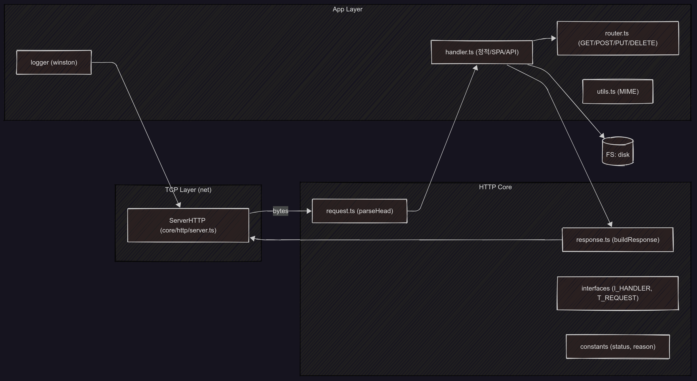
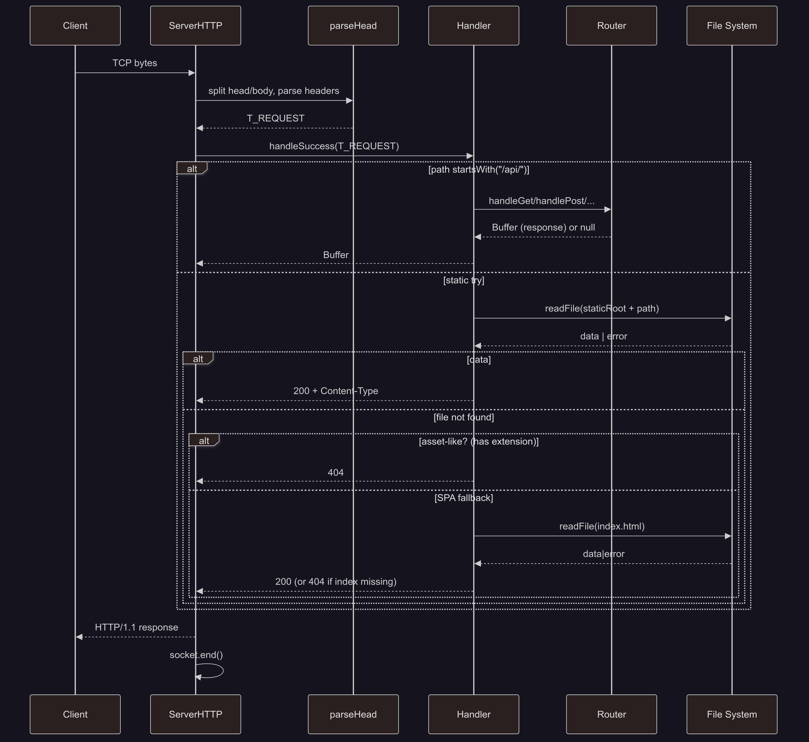

# Tiny Typescript HTTP Server

## Architecture

### Objectives

- Build an HTTP server in TypeScript on top of raw TCP using Node’s `net` module.
- Serve static assets such as `.html`, `.js`, `.css`, and so on.
- Handle REST-style requests (GET / POST / PUT / PATCH / DELETE).
- Switch directory of static assets by `NODE_ENV`.
  - `development`
  - `production`
- Enforce pre-commit hygiene with Husky + lint-staged running ESLint, Prettier, and tests.
- Use `vitest` as the test runner.
- Stand up a Jira Scrum project and use Smart Commits to automate status transitions across Sub-tasks, Tasks, Stories, and Epics. (But it's private project...)

### Overview

#### Runtime

Node.js

#### Transpilation

TypeScript -> CommonJS

#### Networking

Handle TCP server via `net.createServer` -> HTTP parsing -> handler dispatch.
Intentionally minimal layers to keep behavior explicit and observable.

#### Static Assets

##### Development

- `src/static/*`

##### Production

- `dist/build/*`
  - You can override with `PATH_STATIC` environment variables to change `build` directory name without code changes.

#### index.html

- If the request is **not** an API call and the requested static asset doesn’t exist, respond with `index.html`.
  - `app.js`, `index.css` bootstrapping

#### API

- All endpoints live under `/api/*`.
- Aim for pragmatic REST: resource-oriented routes and sensible status codes where implemented.
- To keep scope tight initially, some niceties (e.g., `405 Method Not Allowed`) are deferred.

#### Local CI

- `husky` + `lint-staged` to run pipelines with `eslint`, `prettier`, and `vitest` before commits.
  - Formatting and linting are non-negotiable, and also tests must pass to commit.

#### Testing

`vitest` for fast, Jest-like workflow.

#### Path Aliases

Defined in `tsconfig.json`.

#### Line Endings

Normalize to `LF`
Sorry, Windows.

### Directory Structure

```
mini-ts-http-server/
├── .gitattributes
├── .lintstagedrc.json
├── .prettierrc.json
├── assets
│   ├── diagram-component.png
│   └── diagram-sequence-handling-request.png
├── eslint.config.mjs
├── package.json
├── README.md
├── src
│   ├── config
│   │   └── index.ts
│   ├── core
│   │   └── http
│   │       ├── constants
│   │       │   ├── index.ts
│   │       │   ├── method.ts
│   │       │   └── status.ts
│   │       ├── index.ts
│   │       ├── interfaces
│   │       │   ├── handler.ts
│   │       │   ├── index.ts
│   │       │   ├── method.ts
│   │       │   ├── query.ts
│   │       │   └── request.ts
│   │       ├── query.ts
│   │       ├── request.ts
│   │       ├── response.ts
│   │       └── server.ts
│   ├── handler
│   │   ├── constants.ts
│   │   ├── handler.ts
│   │   ├── index.ts
│   │   ├── router.ts
│   │   └── utils.ts
│   ├── logger
│   │   └── index.ts
│   ├── main.ts
│   └── static
│       ├── app.js
│       ├── index.css
│       └── index.html
├── tsconfig.json
├── vitest.config.js
├── vitest.setup.js
└── yarn.lock
```

### Component Diagram



### Request Handling Sequence



## ...Work in Progress...

- ...

## Setup

```sh
yarn install
```

## Tests

```sh
yarn test
```

## Getting Started

### Running in Development

```sh
yarn dev
```

### Production Build

```sh
yarn build
```

### Running in Production

```sh
yarn start
```
